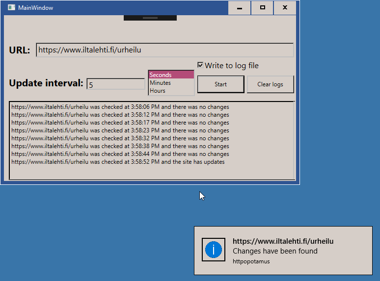
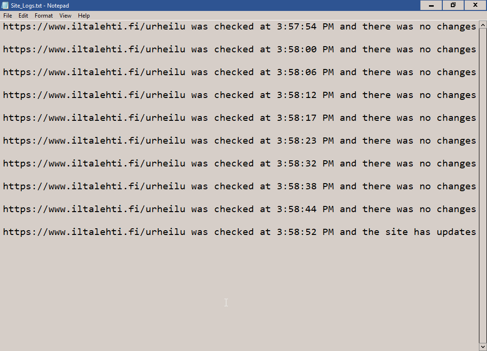

# httpopotamus
Monitor websites and get balloon notifications upon changes in the page's HTML

## Usability
This program is limited to notice all changes, no matter how big or small. Therefore it isn't useful for big websites like Youtube, Amazon etc., which have minor changes every second.

## Screenshots
* Balloon popup \

* Log file \

